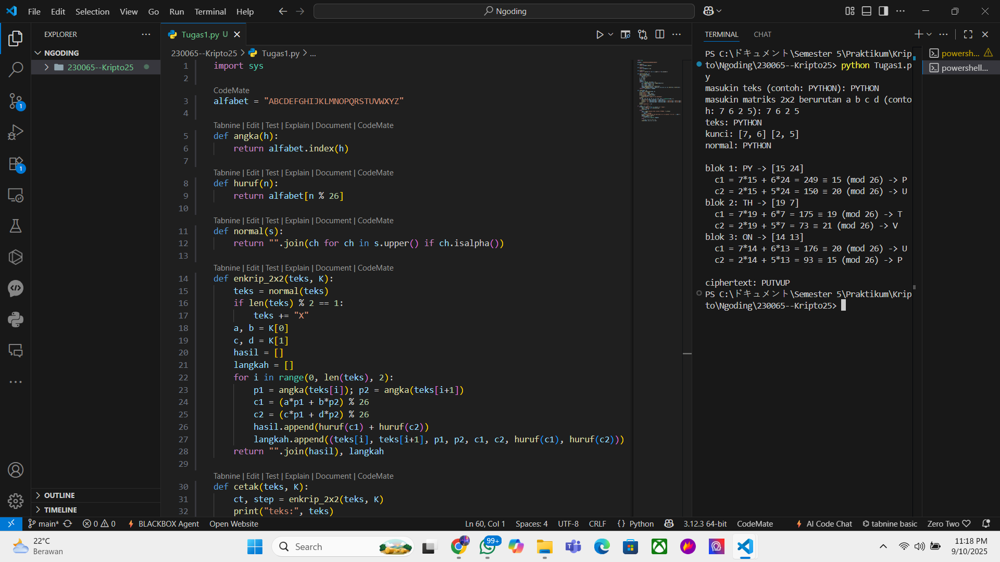

# Tugas 1 — Hill Cipher 2×2 (Enkripsi)

program untuk mengenkripsi teks dengan **Hill Cipher 2×2** beserta **langkah setiap bloknya**.

---

## Ringkasnya
- **Input:** plaintext (huruf A–Z) dan matriks 2×2 `a b ; c d`.
- **Output:** ciphertext + rincian perhitung blok (konversi huruf→angka, kali matriks, mod 26, balik ke huruf).
- **Contohnya:** `PYTHON` dengan `K = [[7,6],[2,5]]` → `PUTVUP`.

---

## Alur Program (bahasa manusia)
1. **Bersihin teks**  
   Teks diubah jadi **uppercase** dan dibuang karakter non-hurufnya.  
   Kalau jumlah huruf **ganjil**, program nambahin **`X`** di akhir biar genap (karena diproses per 2 huruf).

2. **Bikin pasangan**  
   Teks dipotong jadi 2 blok huruf, misal: `PY | TH | ON`.

3. **Huruf → angka**  
   Ubah: `A=0, B=1, …, Z=25`.  
   Contoh `P=15`, `Y=24`, dst.

4. **Kali matriks + mod 26**  
   Untuk setiap blok `[p1 p2]`, dihitung:
   - `c1 = (a*p1 + b*p2) mod 26`  
   - `c2 = (c*p1 + d*p2) mod 26`

5. **Angka → huruf & gabung**  
   `c1,c2` dikonversi balik ke huruf dan disambung jadi **ciphertext**.  
   Program juga menampilkan **jejak perhitungan** tiap blok supaya gampang diverifikasinya.

---

## Kebutuhan
- **Python 3.8+**

---

## Cara Menjalankan
### 1 Mode Demo 
```bash
python Tugas2.py --demo
---
## Running Program

